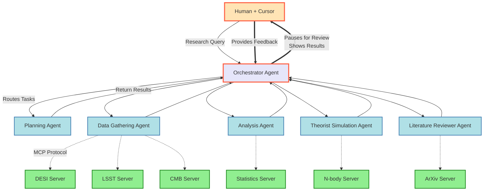

# Astro Orchestra - Multi-Agent Astronomy Research System

A sophisticated multi-agent system for conducting astronomy research using the Model Context Protocol (MCP) to orchestrate specialized agents and external astronomical data tools.

## Quick Start

1. **Clone and Setup**:
```bash
cd astro-orchestra
python -m venv venv
source venv/bin/activate  # or `venv\Scripts\activate` on Windows
pip install -r requirements.txt
```

2. **Configure Environment**:
```bash
# Create .env file with your Google API key
echo "GOOGLE_API_KEY=your_google_api_key_here" > .env
```

3. **Run MCP Server**:
```bash
python -m src.mcp.server
```

4. **Configure Cursor**:
Add to your `.cursor/mcp_config.json`:
```json
{
  "mcpServers": {
    "astronomy-research": {
      "command": "python",
      "args": ["-m", "src.mcp.server"],
      "cwd": "/path/to/astro-orchestra",
      "env": {
        "PYTHONPATH": ".",
        "GOOGLE_API_KEY": "${env:GOOGLE_API_KEY}"
      }
    }
  }
}
```

## Project Architecture



Astro Orchestra uses a multi-agent architecture where:

- **Orchestrator Agent**: Breaks down research tasks and coordinates specialists
- **Data Gathering Agent**: Accesses DESI, LSST, CMB databases via MCP tools
- **Analysis Agent**: Performs statistical analysis and computations
- **Theorist Simulation Agent**: Runs cosmological simulations
- **Literature Reviewer Agent**: Searches and synthesizes scientific papers

All agents communicate through a shared state system and use external MCP tool servers for accessing astronomical data and computational resources.

## MCP Integration

The system exposes itself as an MCP server that can be integrated with AI assistants like Cursor. External astronomy tools run as separate MCP servers, allowing for:

- Dynamic tool discovery
- Scalable tool ecosystem
- Separation of concerns
- Easy tool updates and additions

## Development Status

This project is in active development. Core components are being implemented incrementally.

## License

MIT License 